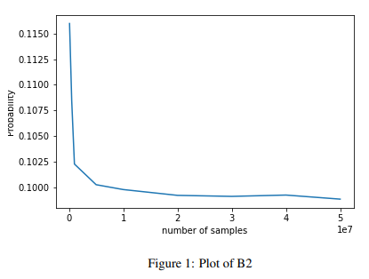
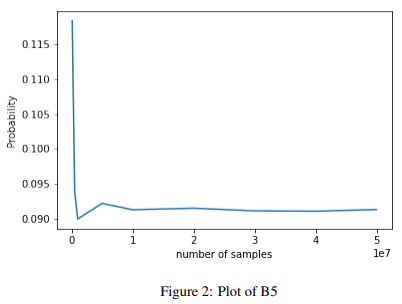
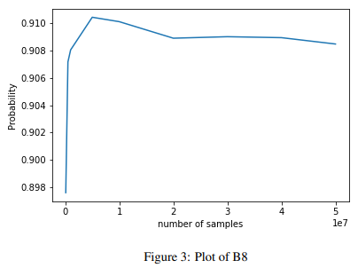

# Likelihood-Weighting

Likelihood weighting is a sampling technique that is an improvement on rejection sampling. It makes sure that the samples align with the evidence and thus, removes rejecting samples and doing repetitive work. In likelihood weighting, we sample only nonevidence variables and weight each sample by the likelihood it accords with the evidence function. 

Consider the belief network shown below, with $n$ binary random variables $B_i \in \\{0,1\\}$ and an ${\it integer}$ random variable $Z$.  Let $f(B) = {\sum_{i=1}}^n\ 2^{i-1}\ B_i$ denote the non-negative integer whose binary representation is given by $B_n B_{n-1}\ldots B_2 B_1$.  Suppose that each bit has prior probability $P(B_i = 1) = \frac{1}{2}$, and that

$$P(Z|B_1,B_2,\ldots,B_n)\ =\ \left(\frac{1-\alpha}{1+\alpha}\right) \alpha^{|Z-f(B)|}$$ 

where $0 < \alpha < 1$ is a parameter measuring the amount of noise in the conversion from binary to decimal. (Larger values of $\alpha$ indicate greater levels of noise.)

## Probability Estimation

Consider a network with $n= 10$ bits and noise level $\alpha=0.1$. Probability estimates $P(B_i=1|Z=128)$ for $i\in\\{2,5,8,10\\}$ using the method of ${\it likelihood\ weighting}$ are as follows:

  
| | Probability |
| --- | --- |
| $P(B_2 = 1\|Z=128)$ | 0.0988 |
| $P(B_5 = 1\|Z=128)$ | 0.0913 |
| $P(B_8 = 1\|Z=128)$ | 0.9084 |
| $P(B_{10} = 1\|Z=128)$ | 0.0 |

## Probability vs number of samples

